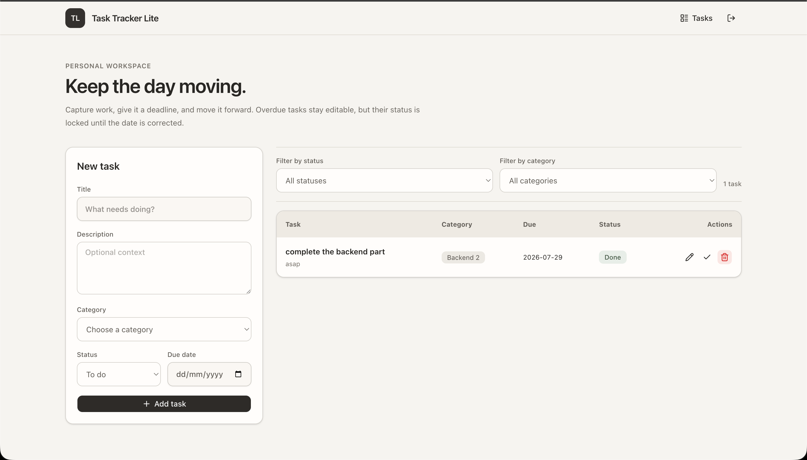
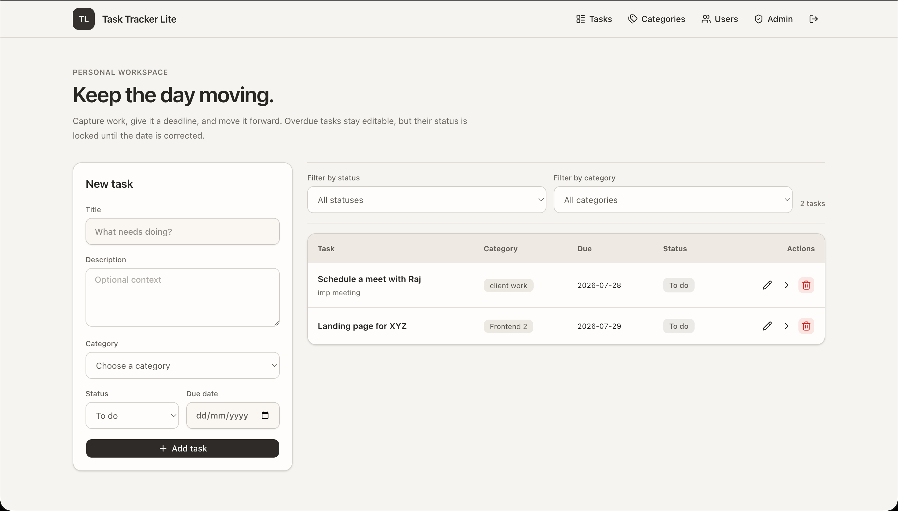
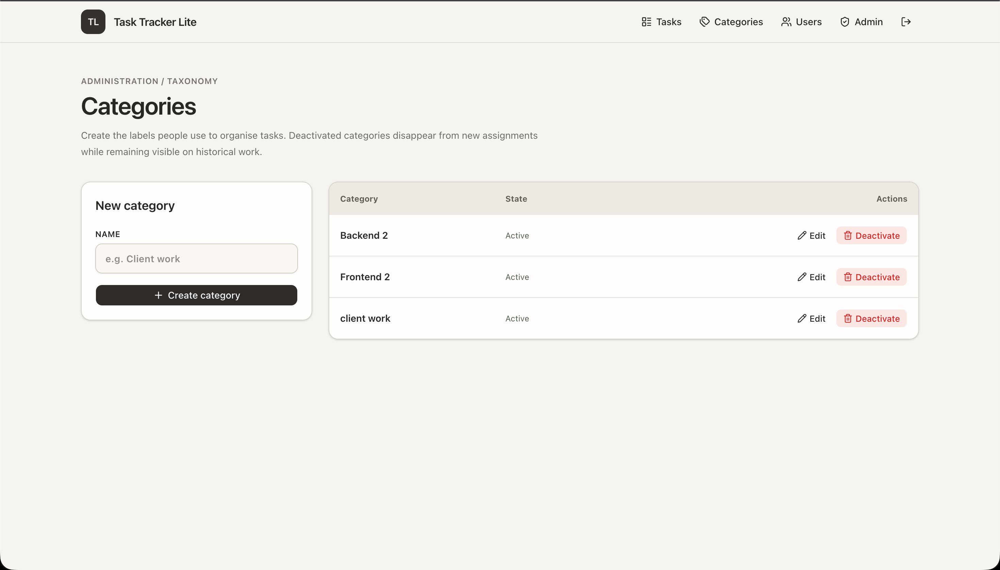
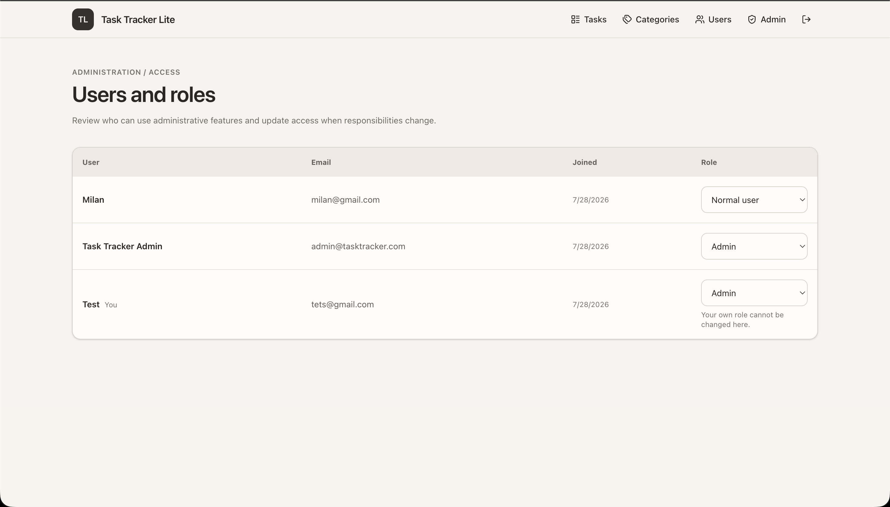
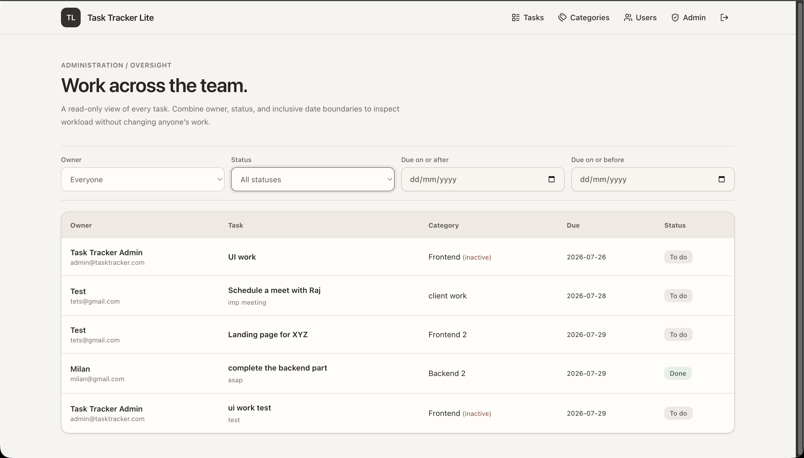

# Task Tracker Lite

Task Tracker Lite is a full-stack task management application.

It supports:

- User registration, login, and logout
- Admin and normal-user roles
- Admin category management
- Personal task creation, editing, status changes, filtering, and deletion
- Due-date restrictions on task status changes
- Admin user and role management
- A read-only admin dashboard for viewing tasks across users
- Docker-based local setup

## Tech stack

- Next.js, React, TypeScript, and Tailwind CSS
- FastAPI, SQLAlchemy, and Alembic
- PostgreSQL 16
- Nginx
- Docker Compose

## Demo

<video src="assets-demo/demo.mp4" controls width="100%">
  <a href="assets-demo/demo.mp4">Watch the full application walkthrough</a>
</video>

### Normal user view

Normal users get a focused personal workspace where they can create tasks, filter them by status or category, update progress, edit details, and delete tasks.



### Admin view

Admins can manage their own tasks as well as the application's categories, users, roles, and team-wide workload.

| Personal task workspace | Category management |
| --- | --- |
|  |  |

| User and role management | Team task overview |
| --- | --- |
|  |  |


## Requirements

Install the following before starting:

- Docker Desktop
- Docker Compose

## Environment setup

Copy the example environment file from the project root:

```bash
cp .env.example .env
```

The default values work for local development, but passwords and secret values should be changed before sharing or deploying the application.

### Environment variables


| Variable                 | Description                                                                                          |
| ------------------------ | ---------------------------------------------------------------------------------------------------- |
| `POSTGRES_USER`          | PostgreSQL username created when the database is initialized.                                        |
| `POSTGRES_PASSWORD`      | Password for the PostgreSQL user. If changed, update the password inside `DATABASE_URL` as well.     |
| `POSTGRES_DB`            | Name of the PostgreSQL database. If changed, update the database name inside `DATABASE_URL` as well. |
| `DATABASE_URL`           | Connection URL used by FastAPI. The host should remain `db` when running through Docker Compose.     |
| `SECRET_KEY`             | Secret used to sign session cookies. Use a long, random value outside development.                   |
| `ENVIRONMENT`            | Base environment value. Compose sets the correct runtime mode for production or development.         |
| `NGINX_PORT`             | Host port for the complete application through Nginx. Defaults to `80`.                              |
| `UI_PORT`                | Direct Next.js development port when using the development Compose override.                         |
| `API_PORT`               | Direct FastAPI development port when using the development Compose override.                         |
| `SESSION_COOKIE_NAME`    | Name of the authentication session cookie.                                                           |
| `SESSION_EXPIRE_MINUTES` | Session lifetime in minutes. The example value is seven days.                                        |
| `ADMIN_NAME`             | Display name for the initial administrator.                                                          |
| `ADMIN_EMAIL`            | Login email for the initial administrator.                                                           |
| `ADMIN_PASSWORD`         | Password for the initial administrator. Use at least eight characters.                               |


The initial admin is created automatically only when the database does not already contain an administrator.

## Run the application


### Standard Docker setup

Build and start the complete application:

```bash
docker compose up --build
```

Open the application at:

```text
http://localhost
```

If `NGINX_PORT` was changed, include that port in the URL. For example, `NGINX_PORT=8080` uses `http://localhost:8080`.

Run the containers in the background with:

```bash
docker compose up --build -d
```


### Development setup

The development override enables frontend and backend source mounts with automatic reload:

```bash
docker compose -f docker-compose.yml -f docker-compose.dev.yml up --build
```

Development URLs using the example configuration:

- Application through Nginx: `http://localhost`
- Next.js directly: `http://localhost:3001`
- FastAPI directly: `http://localhost:8000`
- API documentation through Nginx: `http://localhost/api/docs`


## Admin login

Use the `ADMIN_EMAIL` and `ADMIN_PASSWORD` values from your `.env` file.

Normal registrations always create a normal user. An administrator can update roles from the Users page after signing in.

## Database storage

PostgreSQL data is stored locally at:

```text
volumes/postgres/pgdata
```

The entire `volumes` directory is ignored by Git. The data remains available after stopping or restarting the containers.

Stop the application without deleting database data:

```bash
docker compose down
```

To reset the database completely, stop the containers before deleting the local database directory:

```bash
docker compose down
rm -rf volumes
```

The next `docker compose up --build` command will recreate the folder, initialize PostgreSQL, run all Alembic migrations, and seed the initial administrator.

## Useful commands

Check container status:

```bash
docker compose ps
```

View logs:

```bash
docker compose logs -f
```

Stop the application:

```bash
docker compose down
```

Rebuild after dependency or Dockerfile changes:

```bash
docker compose up --build
```


## API routes

The main API groups are:

- `/api/auth`
- `/api/categories`
- `/api/tasks`
- `/api/admin/users`
- `/api/admin/tasks`
